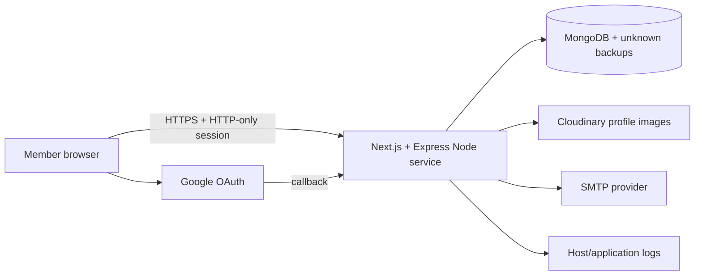

# Threat model

Review triggers: authentication/authorization, member models, uploads, hosting,
logging, backups, providers, API boundaries, or network changes.

| Threat | Preventive controls | Residual work |
|---|---|---|
| Focus/reflection IDOR | Opaque session, authenticated routes, user ID fixed server-side, owner filter on every object mutation | DB integration and adversarial object-ID tests |
| Account takeover | Password hashing, cookie flags, CSRF/origin validation, rate limits, MFA, revocable sessions, hashed recovery tokens | Deployed XSS/session/recovery exercise and monitoring |
| NoSQL/prototype injection | Strict Zod schemas, simple query parser, operator-key rejection, escaped admin search | Fuzz every query/body route and aggregation input |
| Malicious image | Memory/size limits, type/signature/dimension/pixel checks, profile-only purpose | Real scanner, provider alerting, orphan cleanup |
| Sensitive free text in logs/admin | Generalized production errors, aggregate admin dashboard, no reflection content in admin APIs | Provider log inventory and field-level review |
| Administrator abuse | Admin role, MFA enrollment, recent MFA for access changes, audit events, last-admin protection | Operator lifecycle, independent audit review, alerting |
| Cross-site request | Same-origin CORS, signed double-submit CSRF, `SameSite=Lax`, no-store | Test actual production/OAuth origins |
| Denial of service | HTTP/account limits, body/upload limits, startup DB connection | Distributed limits, host metrics and load exercise |
| API bypass/shadowing | Express guards `/api`; one explicit GET-only Next handler | Same-process integration test and review for every new handler |
| Old deployment/store exposure | Current source no longer references clinical systems | Find, freeze, access-review and disposition external stores |

Passing source tests is not a security certification.
