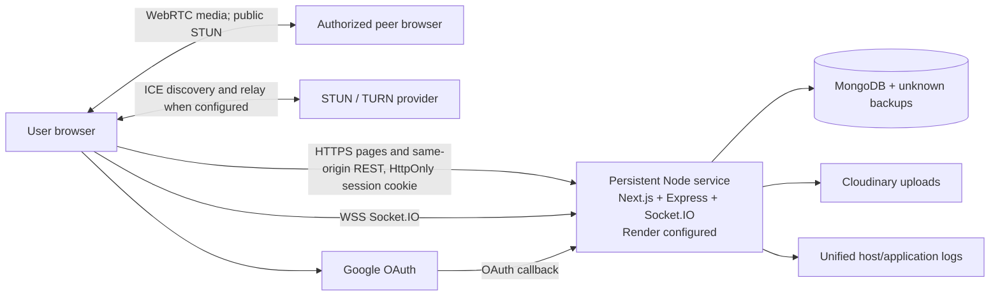

# Threat model

Review triggers: any change to authentication, authorization, models/records, uploads, Socket.IO, WebRTC, hosting, logging, backups, subprocessors, or network boundaries.

Trust boundaries exist at the browser/application ingress, Express API dispatch, WebSocket upgrade, OAuth callback, database, object store, media peer/STUN/TURN service, operator access, and every log/backup copy. Next.js rendering, Express REST handling, Socket.IO signaling, and database startup now share one process and availability boundary. Any prior Vercel or split Render deployment remains a separate unknown boundary until it is independently inventoried and decommissioned.

| Threat | Preventive controls | Detection | Recovery | Residual |
|---|---|---|---|---|
| Record/appointment IDOR | Server-side session auth; patient/assigned-doctor/admin object checks | 403 responses; correlation/audit events; regression tests | Revoke sessions, review access, notify as required | Full deployed integration and IDOR exercise incomplete |
| Video room intrusion/signaling injection | Session handshake; exact-origin admission; appointment lookup; eligible status; current consent; two participants; relay only after join; payload and event limits | `room-error`; correlation/security logs | End room, revoke session, invalidate room ID | TURN policy and adversarial load test pending |
| Account takeover/token theft | Password hashing, expiry, opaque HttpOnly cookie, CSRF, Helmet, rate limits, MFA | Login/MFA/reset audit events | Password reset, session revocation, logout-all | XSS defense and anomaly operations still need review |
| Malicious upload | Auth, size limit, extension-independent MIME allowlist, magic bytes, authenticated clinician delivery | Cloudinary/provider alerting unknown | Remove tracked object and account | Malware scanning/provider assurance pending |
| NoSQL/injection | Zod schemas on high-risk creates; Mongoose casts; role allowlists | Validation errors | Reject/patch | Coverage inconsistent across updates/query params |
| Queue manipulation/duplicate booking | Object authorization; controlled state machine; unique slot reservation; atomic queue counter | Conflict/audit events; isolated concurrency checks | Cancel/reconcile from persisted state | Production-like transaction, retry, and load exercise pending |
| Review fraud | Authenticated patient identity; completed appointment and duplicate checks; reporting/moderation workflow | Reports, moderation status, rate limits, audit events | Withdraw/moderate with reason and appeal | Named moderation ownership and abuse operations pending |
| Insider/operator access | Admin scopes, recent-MFA checks for high-risk actions, break-glass reasons, immutable audit events | Audit-event review capability | Suspend/revoke sessions and investigate | Operator identity lifecycle, log access, and independent review remain unverified; critical launch blocker |
| Sensitive logs | Production errors generalized; socket identifiers removed | Log inventory pending | Purge per provider process | Morgan may log URLs/IP; host retention unknown |
| Denial of service | HTTP/IP/account rate limits, body limits, Socket buffer cap, signaling rate limit, upload limits | Host metrics unknown; audit events for auth abuse | Host-level block/scale unknown | Distributed load and connection-limit exercise pending |
| Shared-process failure or route dispatch error | Graceful shutdown; `/_health`; GET-only allowlist for the Next blog-preview handler; guarded Express API stack and fallback | Process health, 404s, build/regression checks | Restart or roll back the single artifact | A crash affects pages, API, and sockets together; future Next API pass-throughs could be shadowed or bypass Express controls unless explicitly reviewed and integration-tested |

References used for control selection: [OWASP WebSocket Security Cheat Sheet](https://cheatsheetseries.owasp.org/cheatsheets/WebSocket_Security_Cheat_Sheet.html), [OWASP File Upload Cheat Sheet](https://cheatsheetseries.owasp.org/cheatsheets/File_Upload_Cheat_Sheet.html), [HHS covered-entity/business-associate guidance](https://www.hhs.gov/hipaa/for-professionals/covered-entities/index.html), and [FTC Health Breach Notification Rule guidance](https://www.ftc.gov/business-guidance/resources/health-breach-notification-rule-basics-business). Regulatory applicability is not determined by this threat model.
